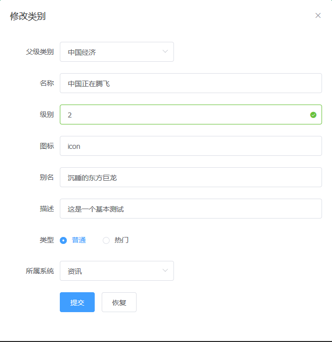

# 使用Vue及SpringBoot实现前后端分离

这个是一个使用Vue开发的内容管理系统，前端基本实现了系统，菜单，类别，标签，专题等的CRUD，而后台项目，请戳这里[springboot-cms](https://github.com/LeeCP8/springboot-cms)。

## 环境
> 1. vue(2.5)
> 2. node(8)
> 3. element-ui(2.2)

## 启动

``` bash
# 由于运行需要后端提供数据，所以请先布署[springboot-cms]（https://github.com/LeeCP8/springboot-cms）
# install dependencies
npm install

# serve with hot reload at localhost:8080
npm run dev
```

## 实现效果





